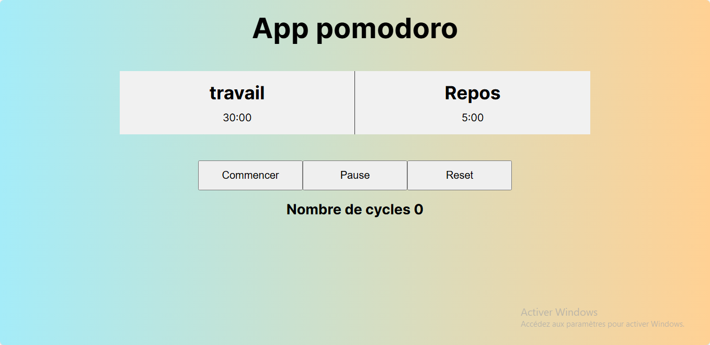

# 🍅 Pomodoro Timer (30/5)

A minimalist productivity timer implementing the 30-minute work / 5-minute rest Pomodoro technique.

## ✨ Features

- ⏱️ **30-minute work sessions** (default)
- ☕ **5-minute short breaks**
- 🔢 **Cycle counter** tracking completed sessions
- ▶️ **Start/Pause/Reset** controls
- 🎨 **Visual progress indicator**

## 🛠️ Tech Stack

- HTML5
- CSS3
- JavaScript

## 🚀 How to Use

1. Click **Start** to begin 30-minute work session
2. Timer automatically switches to 5-minute break when complete
3. Use **Pause** to temporarily stop the timer
4. **Reset** returns to full session time
5. Track completed cycles with the counter

## 🎓 Learning Focus

Built to practice:
- Interval timing with `setInterval()`
- State management (running/paused/stopped)
- DOM updates based on timer state
- Simple arithmetic for time conversion

## 📸 Preview

## 🚀 Live site

- Live site -[Pomodoro](https://pomodoro-three-flame.vercel.app/)

## 🎓 Learning Source
This project was built while following a course on Udemy as part of a training to practice handling cookies in JavaScript.

## 👨‍💻 Author

### Grace Ariane
Passionate about building practical tools to boost productivity 🚀
- linkedIn - [Grace Ariane Tchoukeu](https://www.linkedin.com/in/grace-ariane-tchoukeu)

